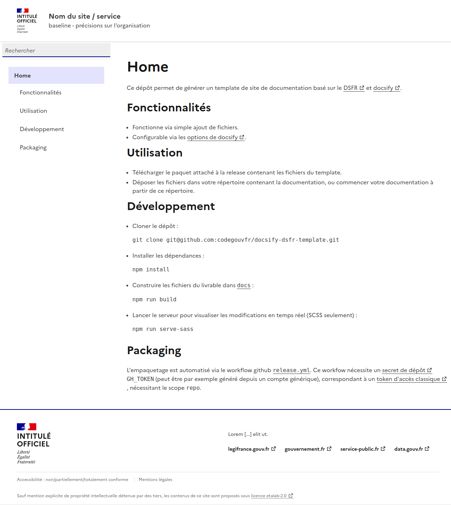

Ce dépôt permet de générer un répertoire de documentation utilisant le [système de design de l'État (DSFR)](https://www.systeme-de-design.gouv.fr).

Le rendu de la documentation utilise [docsify](https://github.com/docsifyjs/docsify).



## Fonctionnalités

- Docsify génère les pages web directement depuis des fichiers Markdown. Il suffit d'ajouter un fichier `.md` et de l'intégrer au menu de gauche via `_sidebar.md` pour qu'il apparaisse dans le menu.
- Le rendu visuel est configurable via les [options disponibles pour docsify](https://docsify.js.org/#/configuration).
- Le rendu au DSFR est à jour avec la dernière version stable.

## Utilisation

- Téléchargez l'archive [`docsfr-[latest].tar.gz`](https://github.com/codegouvfr/docsify-dsfr-template/releases/latest/) lié à la dernière version du dépôt.
- Adaptez le fichier `index.html` selon vos besoins. En particulier, si vous souhaitez que votre documentation pointe vers un dépôt Git, décommentez la ligne du script renseignant le `repo`.
- Commencez à rédiger votre documentation en Markdown dans ce répertoire.
- Publiez ce répertoire via un serveur web.

Par défaut, la page d'accueil est rendue depuis le fichier `README.md` contenue dans le répertoire. Pour ajouter une autre section, créez un nouveau fichier (par exemple `introduction.md`) puis ajoutez-le dans `_sidebar.md` (par exemple `* [Une introduction](introduction.md)`).

## Développement

- Cloner le dépôt :
```
git clone git@github.com:codegouvfr/docsify-dsfr-template.git
```
- Installer les dépendances :
```
npm install
```
- Construire les fichiers du livrable dans [`docs`](docs) :
```
npm run build
```
- Lancer le serveur pour visualiser les modifications en temps réel (SCSS seulement) :
```
npm run serve-sass
```

## Enpaquetage

L'empaquetage est automatisé via [`release.yml`](.github/workflows/release.yml), qui crée une *Release* contenant l'archive des fichiers nécessaires à partir d'un *tag*.

Ce *workfow* nécessite un [secret de dépôt](https://docs.github.com/fr/actions/security-guides/using-secrets-in-github-actions#creating-secrets-for-a-repository) `GH_TOKEN` (peut être par exemple généré depuis un compte générique qui a un accès en écriture au dépôt), correspondant à un [token d'accès classique](https://docs.github.com/fr/authentication/keeping-your-account-and-data-secure/managing-your-personal-access-tokens#cr%C3%A9ation-dun-personal-access-token-classic), nécessitant le scope `repo`.

Il s'exécute automatiquement à l'envoi d'un *tag* qui correspond à un numéro de version (ex. `v.1.0.1`) :
```
npm version 1.0.1
git push
```

## Exemples et réutilisations

- https://codegouvfr.github.io/sill-docs/

## Licence

Ce dépôt est publié sous licence [MIT](LICENSE.md).
